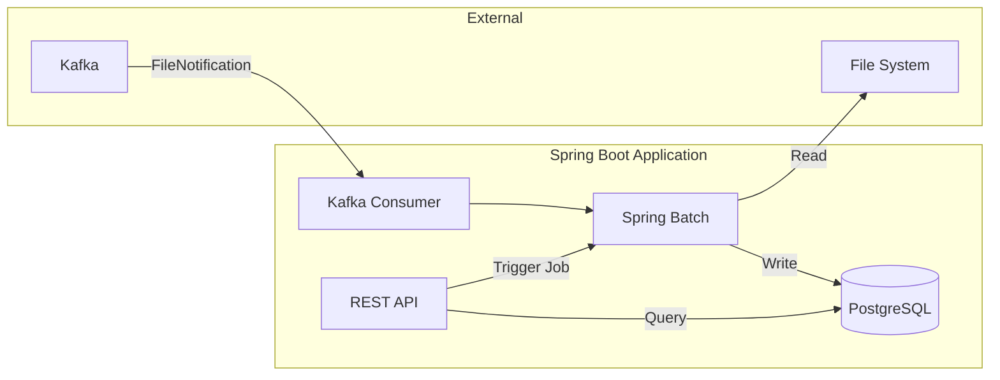

# File Processor

A Spring Boot application that processes CSV files using Spring Batch, with Kafka for event-driven processing and PostgreSQL for persistence.

## Architecture



## Tech Stack

- Java 21
- Spring Boot 3.3
- Spring Batch
- Spring Kafka
- PostgreSQL
- Flyway (migrations)
- Thymeleaf (dashboard)
- Testcontainers (testing)
- Cucumber (BDD testing)

## Prerequisites

- Java 21
- Maven 3.8+
- Docker & Docker Compose

## Quick Start

1. Start infrastructure:
   ```bash
   docker-compose up -d
   ```

2. Run the application:
   ```bash
   mvn spring-boot:run
   ```

3. Open dashboard:
   ```
   http://localhost:8081/dashboard
   ```

## Test Commands

Run unit tests:
```bash
mvn test
```

Run integration tests:
```bash
mvn verify -Pit
```

## Triggering File Processing

Via REST API:
```bash
curl -X POST "http://localhost:8081/api/jobs/process?filename=data.csv"
```

Via Kafka (send FileNotification to `file-notifications` topic).

## Folder Structure

```
├── src/main/java/com/example/fileprocessor/
│   ├── batch/           # Spring Batch configuration
│   │   ├── config/      # Job and step definitions
│   │   ├── dto/         # Data transfer objects
│   │   ├── listener/    # Job listeners
│   │   ├── processor/   # Item processors
│   │   └── skip/        # Skip policies
│   ├── controller/      # REST controllers
│   ├── entity/          # JPA entities
│   ├── kafka/           # Kafka configuration and consumers
│   ├── repository/      # Spring Data repositories
│   └── service/         # Business services
├── src/main/resources/
│   ├── db/migration/    # Flyway migrations
│   ├── templates/       # Thymeleaf templates
│   └── application.yml  # Configuration
└── src/test/            # Tests
```
